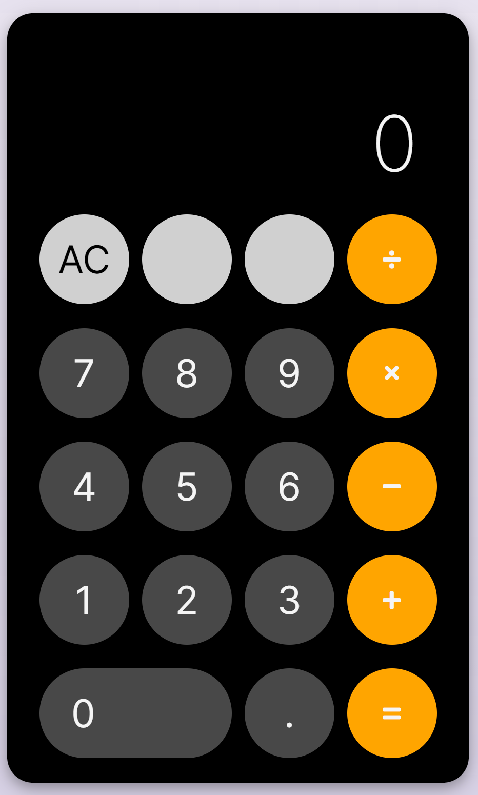

# Calculator App

*Digital calculator that peforms basic math operations.*

View it [here](https://bcherrera14.github.io/calculator-app/)

## Summary

I used Javascript, HTML, and CSS to create a webpage that displays a functional calculator. This calculator performs basic math operations.

## Author

* **Bryan Herrera** - *Full-Stack Developer* - Website | [LinkedIn](https://www.linkedin.com/in/herrerabryan/)  